# Architecture Overview

This document provides a high-level overview of the OpenWiki application architecture, including the UserDefinedModel (UDM) system, policy evaluation engine, frontend structure, and integration with external systems.

## System Architecture

The OpenWiki application follows a layered architecture with clear separation of concerns:

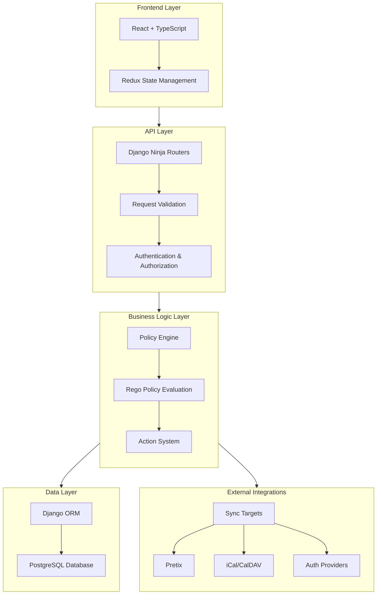

```
+--------------------------------------------------+
|                  Frontend Layer                  |
|  (React + TypeScript + Django Ninja API)        |
+--------------------------------------------------+
|                  API Layer                       |
|  (Django Ninja Routers)                         |
+--------------------------------------------------+
|                 Business Logic                   |
|  (Policy Engine + Action System)                |
+--------------------------------------------------+
|                  Data Layer                      |
|  (Django ORM + PostgreSQL)                      |
+--------------------------------------------------+
|              External Integrations               |
|  (Sync Targets, Auth, etc.)                     |
+--------------------------------------------------+
```

## Core Components

### 1. UserDefinedModel (UDM) System

The UDM system provides a dynamic data modeling framework that allows users to define custom data structures without code changes.

**Key Features**:
- **Dynamic Schema**: Define custom field types and validation rules
- **Workflow Support**: Attach workflows to entities for state management
- **Policy Engine**: Embed Rego policies for business logic
- **Internationalization**: Support for multiple languages

**Architecture**:

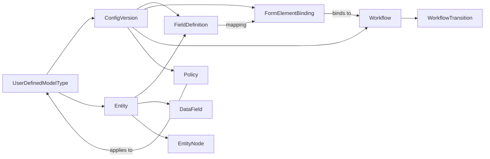

```
UDM System
├── DataField (Schema Definition)
├── FormElement (UI Structure)
├── FormElementBinding (Mapping)
├── Workflow (State Machine)
├── Policy (Rego Rules)
└── ConfigVersion (Versioning)
```

### 2. Policy Evaluation Engine

The policy evaluation engine uses Rego (Open Policy Agent) to evaluate business rules against entities.

**Key Components**:
- **RegoSession**: Compiled Rego engine with caching
- **Policy Input Schema**: Structured input for policy evaluation
- **Action System**: Policy-driven actions (set field values, trigger transitions, send notifications)

**Features**:
- Thread-safe evaluation with thread-local caching
- Deep integration with Django ORM
- Automatic transaction handling
- Comprehensive error reporting

**Policy Evaluation Flow**:

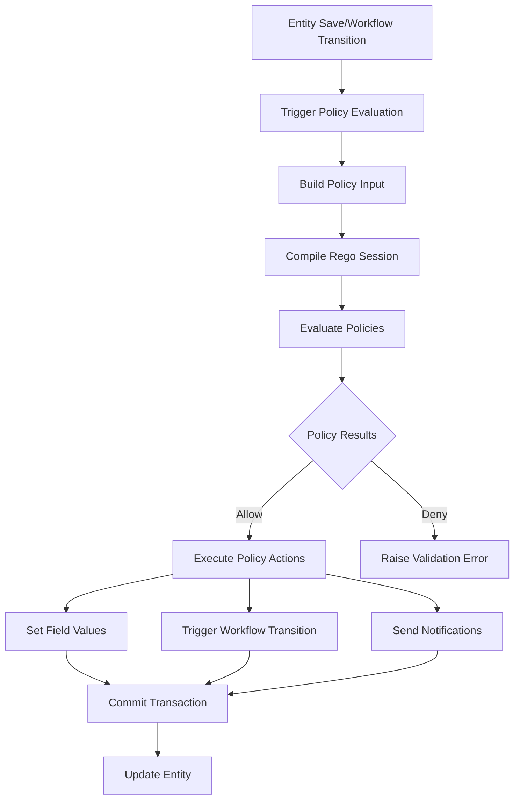

### 3. Frontend Components

The frontend is built with React and provides a user interface for managing UDMs.

**Tech Stack**:
- **React**: UI library
- **TypeScript**: Type safety
- **Django Ninja**: API integration
- **Redux**: State management (optional)
- **React Router**: Navigation

**Main Components**:
- **UDM Admin**: Manage model types, field definitions, policies, and workflows
- **UDM Entity Editor**: Create and edit entity instances
- **UDM Bundle Tab**: Import/export operations
- **UDM Migration**: Migration interface for schema changes

**Frontend Component Architecture**:

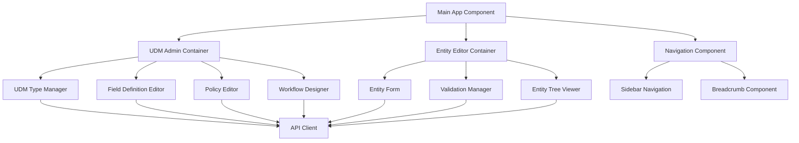

### 4. API Layer

The API layer exposes all functionality through RESTful endpoints using Django Ninja.

**API Endpoint Structure**:

```mermaid
graph TD
    A["API Gateway"] --> B["/api/udm/Configs"]
    A --> C["/api/udm/Types"]
    A --> D["/api/udm/Workflows"]
    A --> E["/api/udm/Policies"]
    A --> F["/api/udm/Entities"]
    A --> G["/api/udm/StagingFiles"]
    A --> H["/api/udm/Bundle"]
    A --> I["/api/udm/Autocomplete"]
    
    B --> B1["Config CRUD"]
    B --> B2["Version Management"]
    
    C --> C1["Type CRUD"]
    C --> C2["Schema Validation"]
    
    D --> D1["Workflow CRUD"]
    D --> D2["Transition Management"]
    
    E --> E1["Policy CRUD"]
    E --> E2["Rego Validation"]
    
    F --> F1["Entity CRUD"]
    F --> F2["Bulk Operations"]
    F --> F3["Search & Filter"]
    
    G --> G1["File Upload"]
    G --> G2["File Staging"]
    
    H --> H1["Bundle Export"]
    H --> H2["Bundle Import"]
    
    I --> I1["Search Suggestions"]
    I --> I2["Autocomplete"]
```

```
/api/udm/
├── /configs/          - Configuration management
├── /types/            - UDM Type definitions
├── /workflows/        - Workflow management
├── /policies/         - Policy management
├── /entities/         - Entity CRUD operations
├── /staging-files/    - File staging for uploads
├── /bundle/           - Import/export operations
└── /autocomplete/     - Search endpoints
```

### 5. External Integrations

The application integrates with external systems through sync targets.

**Sync Targets**:
- **Pretix**: Event ticketing system synchronization
- **iCal**: Calendar format synchronization
- **CalDAV**: Calendar protocol synchronization

**Sync Architecture**:

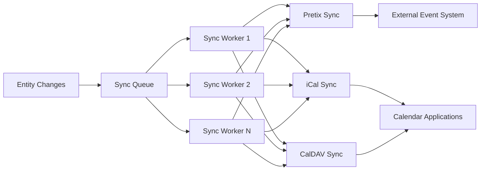

## Data Flow

### Entity Lifecycle

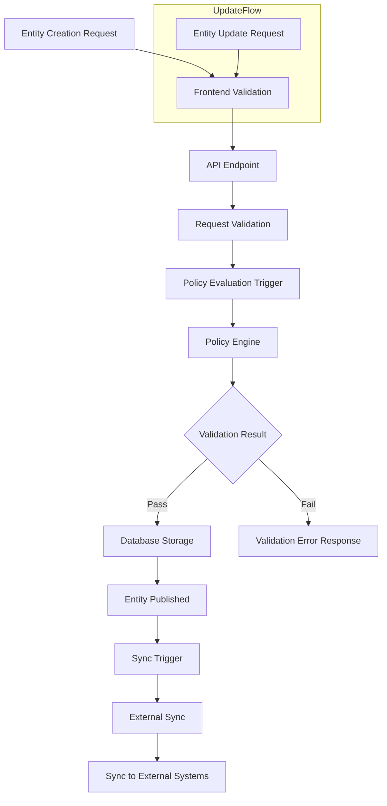

### Policy Evaluation

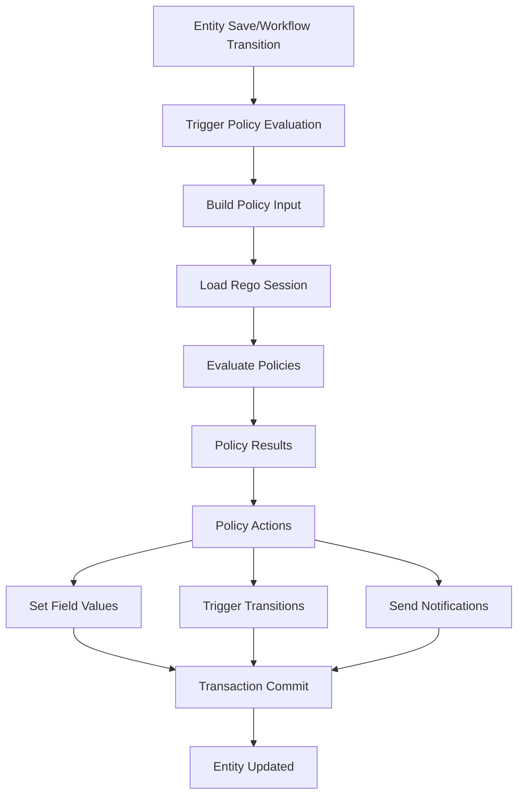

## Data Models

### Core Models

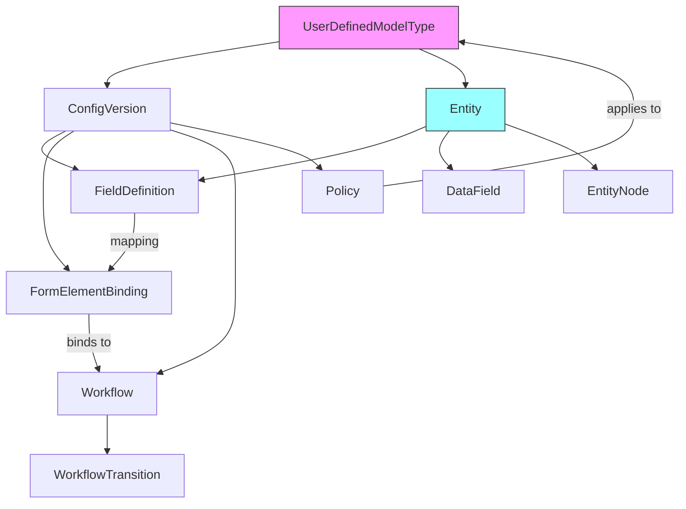

## Security

**Authentication**: Django session authentication with optional OIDC support

**Authorization**: Fine-grained permissions at the entity level

**Input Validation**: Comprehensive validation at all layers (API, model, policy)

**Security Flow**:

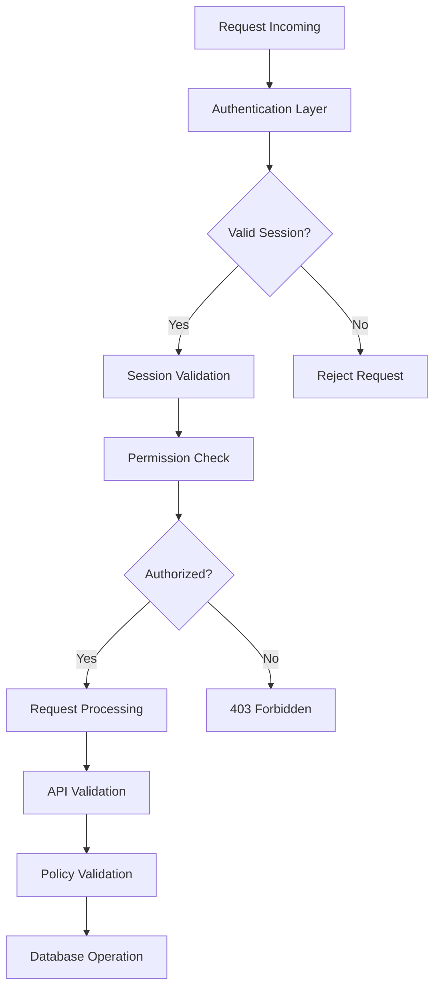

## Scalability

**Caching**: Thread-local caching of compiled Rego policies

**Database**: PostgreSQL with Django ORM optimizations

**API**: Stateless API layer with efficient query patterns

**Horizontal Scaling Architecture**:

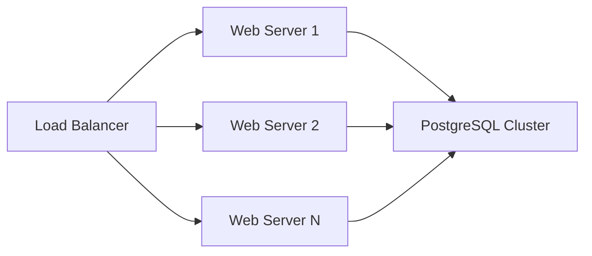


## Documentation References

For more detailed information on specific components, see:

- **[Backend Components](../backend/overview.md)** - Backend architecture and components
- **[Policy Evaluation Engine](../backend/policy_engine.md)** - Rego policy evaluation details
- **[Frontend Overview](../frontend/overview.md)** - Frontend architecture and components
- **[API Endpoints Reference](../api/endpoints.md)** - API endpoint documentation
- **[Testing Overview](../testing/overview.md)** - Testing strategy and documentation
- **[Sync Overview](../sync/overview.md)** - External system integration
- **[Publishing System](../concepts/publishing.md)** - Version and publishing management

